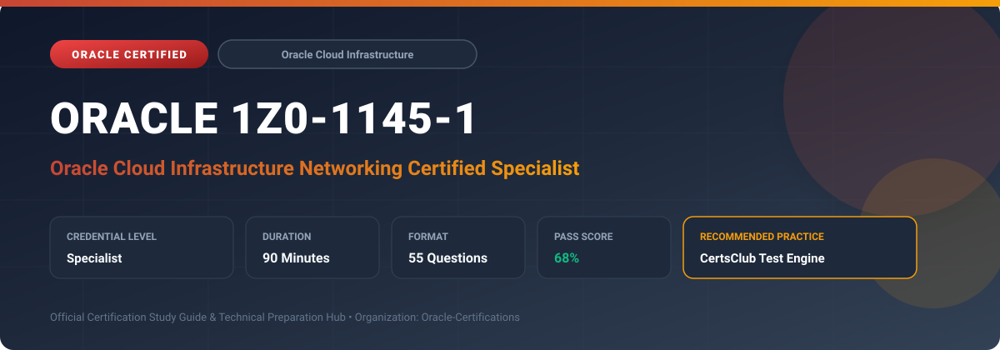

  

# Oracle 1Z0-1145-1: Oracle Cloud Infrastructure Networking Certified Specialist

---

## 1. Exam Overview & Candidate Profile

The **Oracle 1Z0-1145-1: Oracle Cloud Infrastructure Networking Certified Specialist** credential certifies network engineers who design, implement, and maintain advanced virtual cloud networks on OCI.

Candidates prove their expertise in VCN architecture, subnets, route tables, NSGs/Security Lists, Dynamic Routing Gateways (DRG v2), FastConnect, Site-to-Site VPN, Load Balancers, and DNS Traffic Management.

### Target Audience & Prerequisites
- **Target Roles**: Implementation Specialists, Cloud Architects, Technical Leads, Enterprise Consultants, and Systems Engineers.
- **Recommended Experience**: 1–2 years of practical, hands-on experience designing, implementing, and maintaining corresponding Oracle solutions.
- **Credential Earned**: Specialist Certification.

---

## 2. Key Exam Specifications

| Specification | Details |
| :--- | :--- |
| **Exam Code** | **Oracle 1Z0-1145-1** |
| **Official Title** | Oracle Cloud Infrastructure Networking Certified Specialist |
| **Certification Track** | Oracle Cloud Infrastructure |
| **Exam Duration** | 90 Minutes |
| **Number of Questions** | 55 Questions |
| **Passing Score** | 68% |
| **Question Format** | Multiple Choice (Single/Multiple Answer), Scenario-Based Questions |
| **Delivery Provider** | Oracle University / Pearson VUE (Online Proctored or Test Center) |
| **Recommended Practice Engine** | [CertsClub Oracle Practice Tests](https://www.certsclub.com/oracle/1z0-1145-1-dumps.html) |

---

## 3. Official Blueprint & Exam Domain Breakdown

The examination assesses candidate competencies across core functional domains weighted as follows:

| Domain Area | Weighting |
| :--- | :--- |
| **Virtual Cloud Network (VCN) Architecture & Core Routing** | `25%` |
| **Dynamic Routing Gateway (DRG v2) & Hub-and-Spoke Topologies** | `25%` |
| **Hybrid Connectivity (FastConnect & IPsec Site-to-Site VPN)** | `20%` |
| **Load Balancing (Layer 4 Network LB & Layer 7 Flexible LB)** | `15%` |
| **Network Security, DNS Traffic Management & Troubleshooting** | `15%` |

---

## 4. Deep Dive into Complex & Challenging Technical Topics

To secure a passing score on the 1Z0-1145-1 exam, candidates must master the following advanced concepts:

- Designing complex routing with DRG v2: route tables, import distributions, and transit routing through firewall appliances.
- Establishing redundant FastConnect architectures with dual virtual circuits and automated BGP failover.
- Configuring Network Security Groups (NSGs) vs. Security Lists for granular compute VNIC firewall rules.
- Deploying Flexible Load Balancers with custom SSL termination, path-based routing, and backend health checks.
- Analyzing network performance and packet flow using Network Visualizer, VTAP (Virtual Test Access Point), and Flow Logs.

---

## 5. Scenario-Based Demo & Practice Questions

### Question 1
What is the primary architectural advantage of using Network Security Groups (NSGs) instead of Security Lists for microsegmentation in an OCI VCN?

A) NSGs apply firewall rules directly to individual VNICs rather than to all instances in an entire subnet
B) NSGs are completely free while Security Lists require payment
C) NSGs only support UDP protocols
D) NSGs can only be applied to Internet Gateways

- **Correct Answer**: `A) NSGs apply firewall rules directly to individual VNICs rather than to all instances in an entire subnet`  
- **Technical Explanation**: Network Security Groups (NSGs) apply ingress and egress rules at the VNIC level, allowing different security postures for different resources within the exact same subnet.

---

### Question 2
In OCI Dynamic Routing Gateway (DRG v2), what feature automatically propagates routes from attached VCNs, FastConnect circuits, and IPsec tunnels into a DRG route table?

A) Import Route Distribution
B) Service Gateway Routing
C) NAT Overload Rule
D) Local Peering Distribution

- **Correct Answer**: `A) Import Route Distribution`  
- **Technical Explanation**: DRG Import Route Distributions define how routes from attached networks (VCNs, FastConnect, VPNs) are imported into specific DRG route tables, enabling dynamic routing automation.

---

## 6. Recommended Preparation Strategy & Practice Testing Engine

Achieving certification in **Oracle 1Z0-1145-1** requires balanced theoretical study and scenario-based simulation practice:

1. **Review Oracle Documentation**: Master architecture guides, implementation workbooks, and administration manuals on the Oracle Help Center.
2. **Hands-on Lab Practice**: Execute real-world configuration, policy setup, and troubleshooting tasks in your cloud tenancy or test instance.
3. **Simulated Exam Drills**: Practice answering timed, scenario-based multiple-choice questions to familiarize yourself with the question formats, traps, and timing constraints.

### Practice With CertsClub
For realistic practice questions, updated dumps, and mock testing environments:
- **Resource**: [CertsClub Oracle Practice Test Engine](https://www.certsclub.com/oracle/1z0-1145-1-dumps.html)
- **Special Discount**: Use coupon code **`club20`** during checkout for an instant **20% discount** on all practice exam bundles and testing engines.

---

## 7. Official Documentation & References

- [Oracle University Certification Registry](https://education.oracle.com/)
- [Oracle Help Center Documentation Portal](https://docs.oracle.com/)
- [Oracle Cloud Infrastructure & Applications Guides](https://docs.oracle.com/en/cloud/)
- [CertsClub Oracle Certification Exam Practice](https://www.certsclub.com/oracle/1z0-1145-1-dumps.html)

---

## 8. SEO & Discovery Keywords

`oracle 1z0-1145-1, oracle 1z0-1145-1 exam, oracle 1z0-1145-1 dumps, 1Z0-1145-1 practice questions, 1Z0-1145-1 study guide, oracle cloud infrastructure networking certified specialist, certsclub 1z0-1145-1`